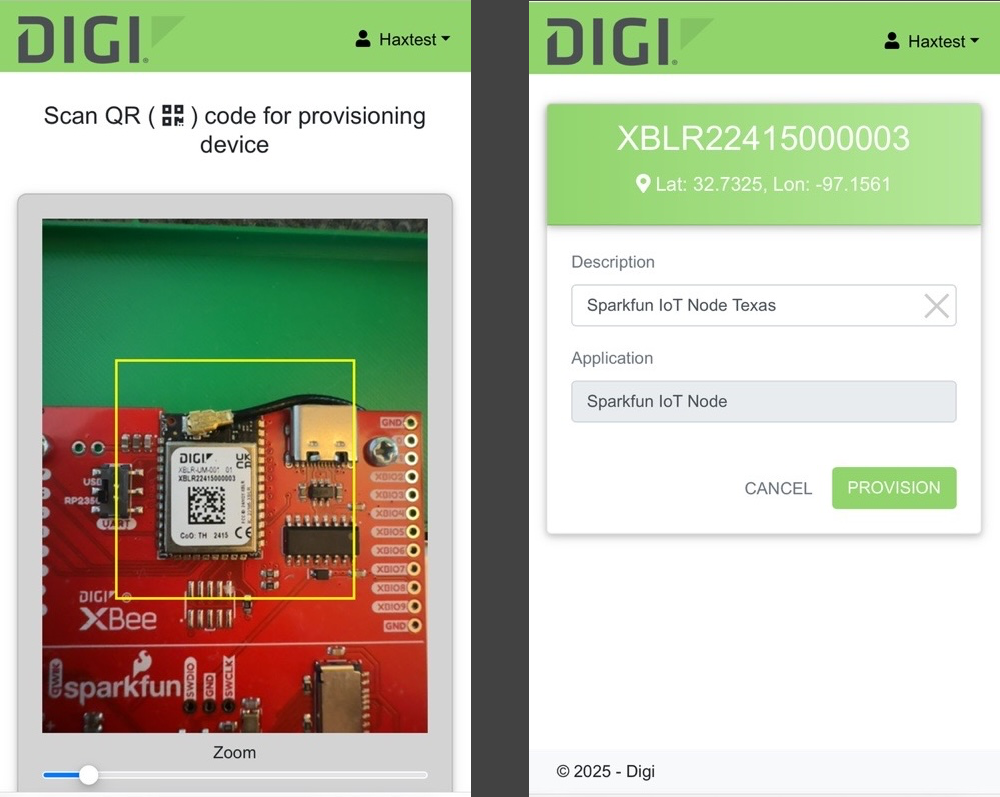
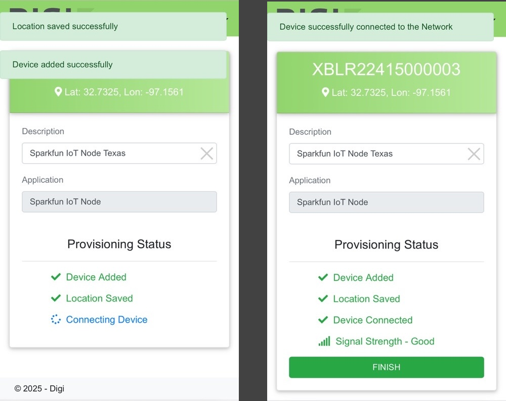
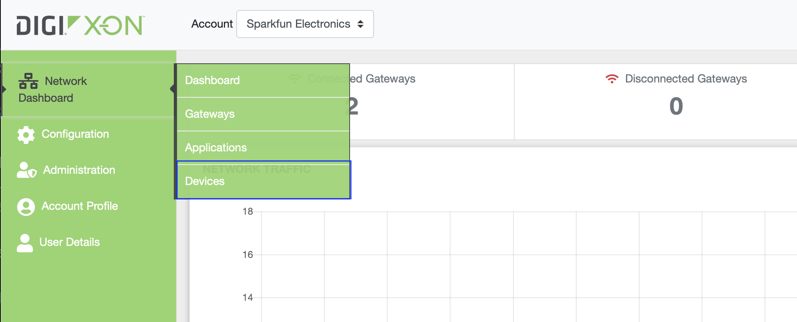
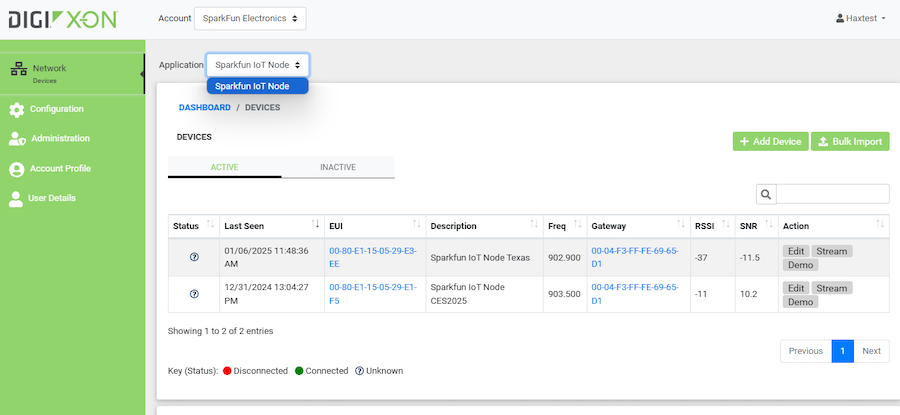
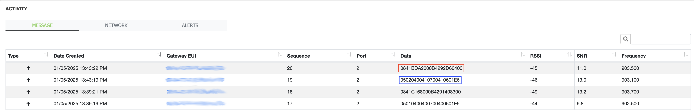
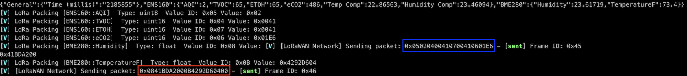

# Getting Started

The SparkFun IoT Node - LoRaWAN firmware is designed to enable rapid setup and connection to the Digi LoRaWAN network or the Digi X-ON system. The SparkFun IoT Node - LoRaWAN board is pre-provisioned with the necessary keys to connect to Digi X-ON, and the default XON Application ID for the demo application is set as default within the IOT Node - LoRaWAN firmware. From the board standpoint, once the Digi module is registered with a XON account, all that is required is to connect the antenna, a supported qwiic sensor and apply power to the board. 

## Setting up your Digi X-ON account and Gateway

To get started, you'll need to have access to an HX15 Gateway (NA or EU version) and a Digi Account. If you've purchased the kit, a Gateway will be included. Digi has a great ["Getting Started" video here](https://youtu.be/nrmTp8ZYa6c?si=9FnklldcUvFMTXLr). The kit also has a welcome card included that contains a QR Code. Scanning this code will take you to a URL where you can register for an account.

## Registering the IoT Node - LoRaWAN 

### Provisioning

To provision a IoT Node - LoRaWAN device, go to the following link, log in if necessary, and scan the Data Matrix on the XBee Module using the [Digi Scan page](https://scan-us1.haxiot.com/). 

Note - if the DataMatrix scan is out-of-focus and unable to resolve, wait a few seconds and a manual entry prompt will appear on Digi Scan. From here you manually enter the modules serial number. 

Using the mobile interface, the module registration scan has the following appearance, with a provisioning screen shown once the data module is detected:

Once scanned, attributes are entered and the Application for the board selected - in this case the application is ***Sparkfun IoT Node***:

And once the *PROVISION* button is pressed, the following status/steps are show in the application as the module is provisioned...

After you device is registered with your account, it will be listed in the device section of you XON account.

Device listing

From the specific device page, the messages sent by the device are listed. The ***Data*** column contains the message data.

With the highlighted corresponding sent messages reported on the output of the IoT Node board:

## Troubleshooting and Notes

### If the Node Board Fails to Connect

* Make sure your Digi XON gateway is powered on, connected and connected to a network
* Verify that the LoRa Antenna is property connected to the IOT Node - LoRaWAN board

### Application ID or Key Error message printed at startup

While not often, this has been seen with some new boards. Restarting the board a couple of times often resoles this issue.

If it persists, verify the values being used via the settings menu. If need be, reset the board via the menu system to clear out any invalid value.

Note: The Application and Network Key values are ***secret***, and as such stored securely on the device and not visible once entered.  

### Notes

* Sometimes the first data message fails to send on setup. This is only after initial setup, with following messages successfully sent.