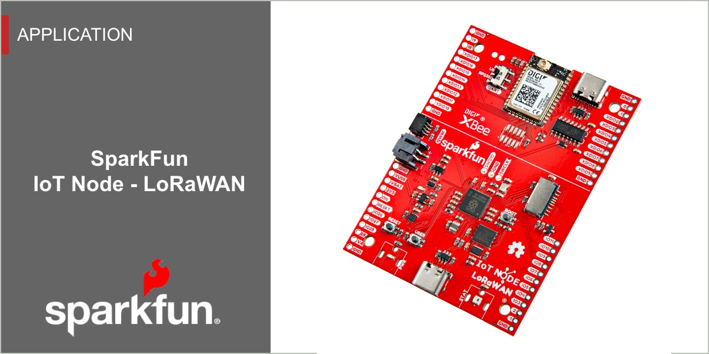

# SparkFun IoT Node - LoRaWAN

Firmware and associated Documentation and Firmware for the SparkFun IoT Node - LoRaWAN product

This repository contains the latest firmware for the SparkFun IoT Node - LoRaWAN development board. While the IoT Node - LoRaWAN development board is programmable using Arduino, the IoT Node - LoRa board ships with a firmware application that enables rapid sensor definition and deployment on a Digi LoRaWAN XON network. This repository contains the source for this LoRaWAN application and well as firmware releases.

The IoT Node - LoRaWAN firmware is pre-programmed to automatically log data from 25+ SparkFun [Qwiic](https://www.sparkfun.com/qwiic) sensors, all without requiring any hardware setup or code development. Just plug in a qwiic board, and log data to the LoRaWAN network. The IoT Node - LoRaWAN board automatically detects the connected sensor, configures the device and enables logging to the serial console and, if connected, to the Digi LoRaWAN network.

The SparkFun IoT Node - LoRaWAN board and firmware are designed to enable posting data to the LoRaWAN network within minutes, requiring no development or configuration. The SparkFun IoT Node - LoRaWAN board is configured to work with the Dig LoRaWAN network. Once the board is registered with your Digi XON account (via the on-board digital data tag - which is similar to a QR code), the board with this firmware should automatically connect to your Digi LoRaWAN account. Connect a supported qwiic sensor and data is automatically posted to the LoRaWAN network.

The IoT Node - LoRaWAN firmware is highly configurable via an easily to use serial interface. Simply plug in a USB C cable and open a terminal at 115200 Kbps. By default the logging output is automatically streamed to the serial terminal - pressing any key will bring up the menu system.   

## Latest Firmware

* Version 01.00.00 - [Release](https://github.com/sparkfun/sfe-iot-node-lorawan/releases/tag/v01.00.00)

## Documentation

* **[Hardware Hookup Guide](https://docs.sparkfun.com/SparkFun_IoT_Node_LoRaWAN/quick_start/)** - Basic hookup guide for the SparkFun IoT Node - LoRaWAN board
* **GitHub Hardware Repo**
  * **[SparkFun IoT Node - LoRaWAN](https://github.com/sparkfun/SparkFun_IoT_Node_LoRaWAN)**
  
## Supported Products

* **[DEV-26060](https://www.sparkfun.com/products/26060)** - SparkFun IoT Node - LoRaWAN

### Latest Release

Details on the latest Firmware release are listed on the [Release Page](https://github.com/sparkfun/sfe-iot-node-lorawan/releases)