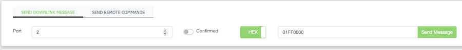

# Additional Functionality

## Sending Data to the IOT Node - LoRaWAN board

To demonstrate the ability to send commands to the IoT Node - LoRaWAN board, the firmware implements some simple commands to change the on-board RGB LED of the device. While simple, the commands demonstrate the flexibility of this functionality.

### General Command Structure

The LED command structure consist of a set of Hex (number) codes sent to the target SparkFun IoT Node - LoRaWAN board via port 2 of the LoRaWAN connection. 

And example of this in the Digi XON control panel for a IoT Node - LoRaWAN device is shown in the following image:

This sends the command code **0x01FF0000**, which turns on the on-board LED and sets the color red. Note - the port value is set to 2. 

Command codes have the following general structure:

**[Command Code - 1 byte][RGB Color - 3 bytes]**

The available command codes:

|Code| Payload | Description |
|--|--|--|
|01|RGB value | Turn on the LED, set to the provided RGB value|
|02| <none> | Turn off the LED|
|03|RGB Value | Blink the LED using the provided RGB value|
|04|RGB Value | Fast blink the LED using the provided RGB value|
|05| Brightness | Set the brightness of the LED - a 1 byte value: 0 - 255|

## Button Events

The SparkFun IoT Node - LoRaWAN board has a "user button". When pressed, the button will perform the following actions:

|Type| Description|
|--|--|
|Momentary Press|When the button is momentary pressed, a log-event is triggered.|
|Pressed and Held| When the on-board is pressed and held down for 30 seconds, the IoT Node - LoRaWAN board is reset: settings are erased and the board restarted.|

## LED Flashes

During the normal course of operation, the IoT Node - LoRaWAN board firmware will enable and flash the on-board LED as an operational indicator. The following table outlines what each LED value indicates:

|Color|Flash|Description
|--|--|--|
|Green| No | System Startup|
|White | No | Settings Menu is use|
|Blue | Blink | Logging event triggered|
|Green | Blink | Data sent to the LoRaWAN|
|Yellow | Flashing | User button held down - faster blink over time|
|Red | Flashing | User button held down - about to reset the board|