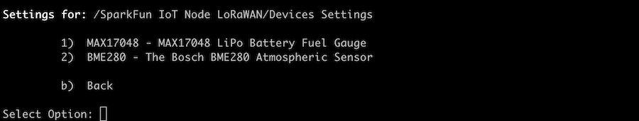
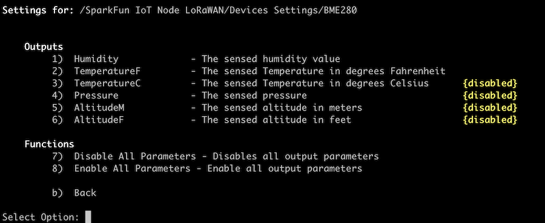
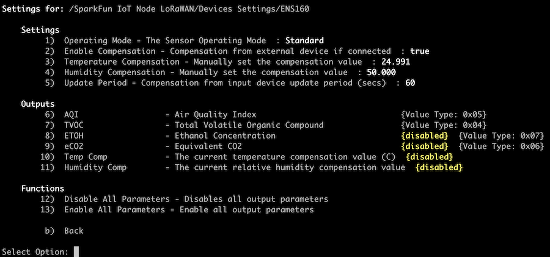

# IoT Node - LoRaWAN  - Device Settings

The device settings menu of the system presents the property pages for each device connected to the IoT Node - LoRaWAN board. 

The contents of the Device Settings page is dynamic and changes based on the devices connected to the board. The following is an example of a device settings listing page:

In this page, the devices ***MAX17948*** and ***BME280*** are listed. Selected an individual device entry will bring up the property page for that device.

Below is the property page for the ***BME280** device:

While the contents of a specific device settings page is dependent on the particular device, each page as a common set of operations.

## Parameters

All devices have a set of parameters, as shown in the above device page for the BME280 device. 

Parameters can be enabled/disabled, controlling which values are output - logged to the Serial Console and sent to the LoRaWAN. 

Each device allows the enabling/disabling of individual parameters, but functions are also provided to enable or disable all parameters with one operation. 

When a parameter is disabled, it is highlighted on the devices settings page.

### LoRaWAN Sent Values

Not all parameters are sent via the LoRaWAN - only those that *make sense* for the limitations of the LoRaWAN system. To determine which values are sent, consult the Advanced section of this documentation, or enable verbose messaging and display a devices settings page. The format of this is shown in the settings page of the ENS160 device later on this page. 

## Properties

If a device as available properties, these are listed on the devices settings page. The following page shows properties and parameter settings for the ***ENS160*** device.

The properties/settings behave just like any other setting within the system. Once set, if a device with the same name/type is loaded, the saved settings are applied at startup. 

