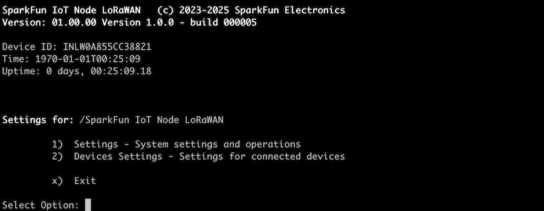
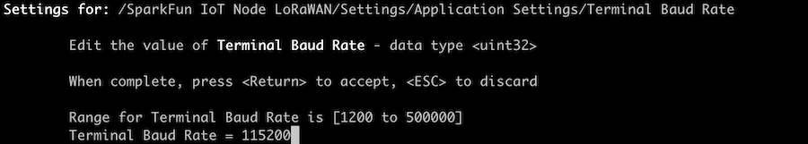
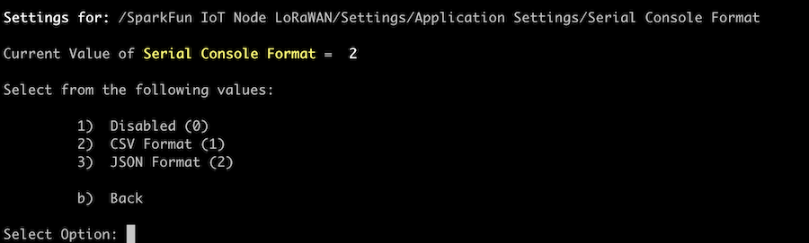
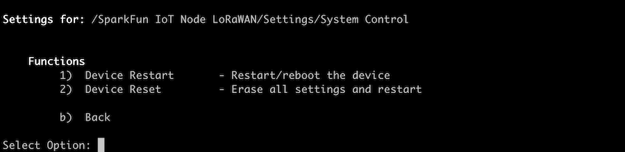

# Settings Overview

One of the unique features of the SparkFun IoT Node - LoRaWAN firmware is the interactive serial console menu system it provides. This dynamic system allows end user access to the operational settings of the system, without the requirement of additional software development or configuration files. Each subsystem and device within the framework has a set of operational properties and functions that are user accessible via the serial menu. 

## Operation

The operation menu is access from a serial console - connected to the IoT Node - LoRaWAN board via a USB-C connection. A *modern/interactive* console is required for this operation - which most modern implementations are. Examples include the **scree** and **minicom** commands on a Linux or macOS system, or **TerraTerm** on a Windows platform. 

### Navigation

During normal operation, the IoT Node - LoRaWAN firmware will output startup information to the Serial console, followed by data log information every time a log event occurs. Once startup is completed, the serial menu can be entered by pressing any key except `!` (which allows entry of a console command) at the serial console. When pressed the top level of the menu system is present and will look similar to the following image.

The top menu outputs general information about the board and presents two options:

 - 1\) Settings - System settings and operations
 - 2\) Device Settings - Settings for connected devices

 To select a entry in a menu, press (or letter) the number corresponding to the menu entry. So in the above examples, pressing `1` will select the Settings menu, and pressing `2` selects the Device settings menu option. 

 To exit a menu, press `x` (exit) at the top menu or `b` (back) at any level of the menu system. Additionally pressing the `escape` key will leave the current menu page, and if pressed on the top menu, any modified property values are not saved to on-board persistent storage. 

 Note - if a menu is left in an idle state, the system will exit the current page after a timeout period.

In the system there are to types of actionable entries - **Properties** or attributes of the system, and **Functions**, which execute a specific operation within the system. 

## Properties - Entry and Editing

Properties represent a particular setting or attribute of the system. They have default values as defined by the firmware application, but are user settable. Properties values are saved to the onboard flash storage of the IoT Node - LoRaWAN board, and as such persistent across device restarts.

When a value is edited in the menu, any changes are saved when the menu system is normally exited - exiting with the **escape** key will not save any changes.

 When an individual entry is selected, a prompt which is based on the entry type, restrictions and value. 

#### Simple Prompt

 When entering a simple value, a basic prompt is presented, as shown in the following image, where the Name of the board is entered:

 

#### Data Range

Some values have a range limit - requiring the value being entered be within a specified set of limits. The following image shows a valid range of 1200 to 500000 for the Baud Rate property of the device.

#### Valid Value Limits

Properties can also have a specific set of valid values available. The following image show the valid values for logging output to the Serial Console. The selected value is limited to one of three values: 1 - Disabled, 2 - CSV Format and 3 - JSON Format. No other valid value is accepted by the system.

## Functions

Functions represent an action that is performed when selected and executed. When a function is selected, the user is always presented with a prompt. The prompt can be a simple "Yes/No" confirmation or or a specific value to pass to the function.

The following image shows a set of Functions that either restart or reset the IoT Node - LoRaWAN device.

When a specific function is selected, as with the selection of "Restart" in the above list, the system prompts the user before executing the function.

Pressing 'Y' will execute the Restart Function in the above example - selecting 'n' or pressing the 'escape' key aborts the function call and returns to the menu system.