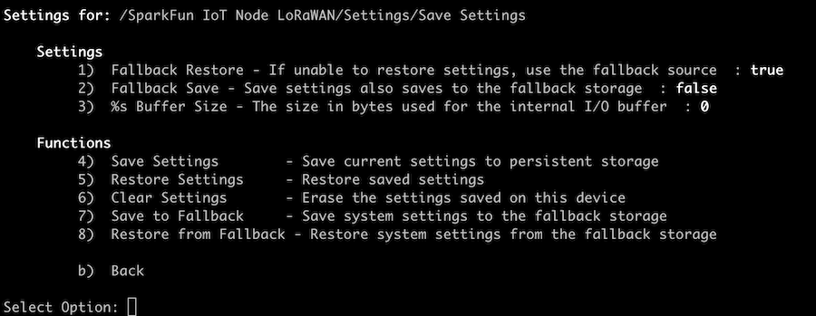

# IoT Node - LoRaWAN Settings

The following sections provide an overview of the available settings and functions within the settings menu of the IoT Node - LoRaWAN firmware.

The settings system is divided into two sections - ***Settings*** and ***Device Settings*** as shown in the following image:

## Settings - System Settings and Operations

When this entry is selected, the following entries are presented:

### Application Settings

The ***Application Settings*** menu has the following entries:

#### Color Output

When enabled (the default), output to the console will use colors to highlight values and functionality. When disabled, all output is plain text. When using a limited serial console application, set this value to false.

#### Board Name

Set this value any name desired for the particular board. By default this value is ***empty***.

#### Serial Console Format

This property sets the output format for sensor/log data for the serial console. Available values include CSV, JSON and Disabled. The default value is ***CSV***.

#### JSON Buffer Size 

This is the size - in bytes - the application should use when building JSON formatted output. The default value is ***1600*** bytes. This value should only be adjusted if logging a large number of values to the serial console. 

The maximum bytes used by the JSON system is displayed on the ***About*** page of the application (try using `!about` console command to see this value).

#### Terminal Baud Rate 

Use this value to change the baud rate settings for the serial console. Once changed this value might require a system restart to  take effect. The default value is ***115200***.

#### Device Names

When enabled (default is ***disabled***), attached devices have their address appended to the name. This is helpful to identify a particular board when two or more of the same board type are attached to the IoT Node board.

#### Startup Delay

When the IoT Node board starts up, an startup menu is displayed. This settings determines how long to display this menu. Setting this value disables the menu. 

The startup menu has the following options:

Pressing the indicted menu key selects that option. If the startup delay expires, a *normal* startup sequence occurs.

##### Startup Menu Entries

* 'n' = Normal startup sequence 
* 'v' = Verbose output messaging is enabled at startup
* 'a' = Disable qwiic device autoload 
* 'l' = List the available qwiic/i2c drivers at startup (this list is deleted after startup)
* 's' = Disable settings restore on startup 

#### Verbose Messages

When enabled, verbose output is enabled. This value is ***disabled*** by default.

#### About...

When selected, the system displays the ***About*** page for the application. This reflects the current status of system. This page is also displayed using the `!about` console command.

### LoRaWAN Network 

The LoRaWAN Network page has the following settings:

#### Enabled

Used to enable/disable the LoRaWAN network functionality. This value is *enabled* by default. 

#### Application EUI 

The Application EUI for the LoRaWAN connection

#### Application Key

The Application Key for the LoRaWAN connection. This value is *secret*, and while editable, it is not visible when editing. 

#### Network Key 

The Network Key for the LoRaWAN connection. This value is *secret*, and while editable, it is not visible when editing. 

#### LoRaWAN Class 

The operating class for the LoRaWAN module. By default this value is set to ***C***.

#### LoRaWAN Region 

The operating region for the LoRaWAN module. By default this value is ***US915***. 

#### Reset

Calls the *reset* function on the module. 

### LoRaWAN Logger 

This pages has no entires currently.

### Logger

The logger system is used to output values to the Serial Console. 

The logger has the following settings:

#### Timestamp Mode

Enables output of a timestamp to the logged information and sets the format of the timestamp. By default this is ***disabled***. 

#### Sample Numbering

If enabled, a sample number is included in the console output of logged data. This value is ***disabled*** by default.

#### Numbering Increment 

The amount to increment each sample number when sample numbering is enabled. The default value is ***1***.

#### Output ID

When enabled, the board ID is included in the logged output. This value is ***disabled*** by default. 

#### Output Name

When enabled, the board Name is included in the logged output. This value is ***disabled*** by default.

#### Rate Metic

When enabled, metrics are recorded for the logging system. This value is ***disabled*** by default.

#### Reset Sample Counter

Resets the data sample number to a user provided value. 

### Logging Timer

The timer has the following properties:

#### Interval

The interval for the logging timer. For every *interval* period, a logging event occurs - sending data to the LoRaWAN and serial console (if enabled).  The default value is ***90000 ms***.

### System Control

The System Control page includes the following entries:

#### Device Restart

When selected, the user is prompted to restart the device/system. This is also available using the `!restart` console command.

#### Device Reset

When selected, the user is prompted to reset the device/system. A device reset erases the current saved settings values and restarts the board/system. This is also available using the `!reset-device` console command.

### Time Setup

By default the IOT Node - LoRaWAN is not connected to a timekeeping source and defaults to a start time value of January 1, 1970 (epoch value of 0). But if a time keeping device is added (GNSS or Real Time Clock), this page is used to set time parameters for the board.

The Time Setup property page has the following entries:

#### Time Zone

The timezone specification string to use for the system clock. By default, the Mountain Time zone (the zone of SparkFun) is used. 

#### Reference Clock

If a reference clock device is connected to the IoT Node board, use this option to select this clock. 

#### Update Interval 

Specify how often the system clock is updated using the reference clock in minutes.

#### Enable Clock Fallback

Adds a secondary reference clock to use if the primary clock becomes unavailable. 

#### Dependant Interval 

If a *dependant* clock is connected (a clock being set by the system clock), this value sets how often the dependant clock device is updated.

#### Update Connected

If enabled, any connected clocks have their time updated when the system clock is updated.

### Save Settings

The Save Settings system is designed to include a "fallback" settings system if available. Normally this might be a JSON file on a SDCard or similar device. At launch, this functionality is not available for the IoT Node - LoRaWAN board.

The Save Settings property page has the following elements:

#### Fallback Restore

If enabled, restore settings from the fallback system if the primary storage system is unavailable or empty. 

#### Fallback Save 

If enabled and a fallback device is available, saving settings to primary storage also saves them to the secondary device.

#### Buffer Size 

The buffer size used for internal I/O operations. This is not used for the IoT Node Board. 

#### Save Settings

When called, the current value of the systems settings is saved to the primary persistent storage system.

#### Restore Settings

When called, systems settings are restore from the primary storage system.

#### Clear Settings

When called, the primary (on board) settings storage is erased/reset.

#### Save to Fallback

If a fallback device is available, when this function is called, system settings are saved to the fallback device.

#### Restore from Fallback

If a fallback device is available, when this function is called, system settings are restored from the fallback device.