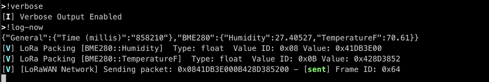
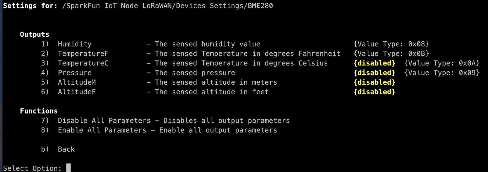
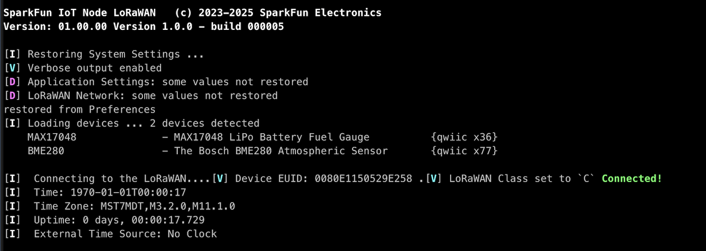

# Verbose Output

For advanced work with the firmware, enabling **Verbose Mode** is incredibly helpful. This is especially true for data encoding and transmission. 

When verbose messaging is enabled, verbose messages are prefixed with a **[V]** and Debug messages are prefixed with a **[D]**.

## Enabling verbose Mode

There are three main methods to enable verbose mode:

| Location | Details |
|--|--|
|Settings Menu | Settings>Application Settings > Verbose Messages. Enabled/Disable Verbose Messaging. This setting will persist across restarts.|
!!verbose Console Command| This toggles verbose messages and is not persistent|
|Start Menu - Select option 'v' | Enables verbose messages before system startup. This value is not persistent|

## Output LoRaWAN Encoding

When verbose messaging is enabled, when a loRaWAN message is packed, the packed values and the overall payload is output. 

The following is an example of output for two data values:

In this example, verbose output is enabled using the console command **!verbose**, and a logging event triggered using **!log-now**. 

Two sensor values are packed for transmission - **Humidity** and **TemperatureF**. The verbose message output includes the Value Type/ID for each data value, as well as the encoded value in hexadecimal. 

And once a LoRaWAN data payload is sent, the entire 11 byte payload is output, along with it's send status and associated frame ID. 

## Device Value Type IDs

For each supported device, a subset of parameters are enabled for LoRaWAN transmission. With verbose output enabled, these parameters are indicated by having a Value Type ID when viewed in on a device settings page. 

The following is an example of the Value Type codes for the BME280 device:

On this page, the parameters that have **Value Types** codes are enabled for LoRaWAN transmission. 

> [!NOTE]
> Parameters that are disabled are not sent to the LoRaWAN.

## Startup Messages

If Verbose Output is enabled and save in the system settings, or if the ***[v]erbose*** startup mode was selected, some addition messages are output during the startup sequence. 

And example of startup messages:

In this example, "Verbose Output" was enabled in the system settings, and is noted on startup. 

Several **Debug** messages related to some settings not saved/restore - but these can easily be ignored. 

Additional information is output when connected to the LoRaWAN network, including the device EUID, and what operating class the LoRaWAN module is set to. 
